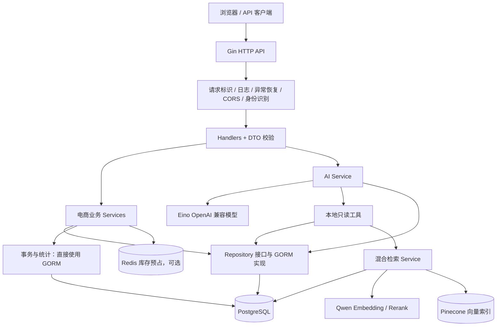
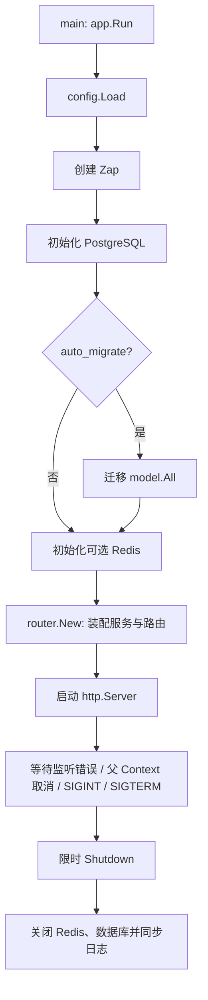
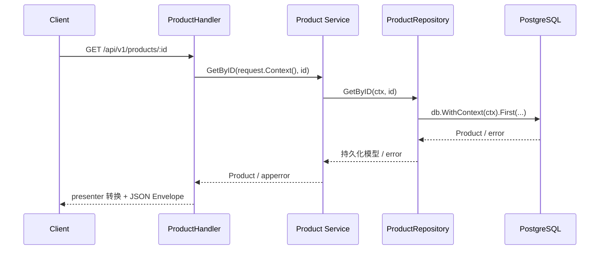
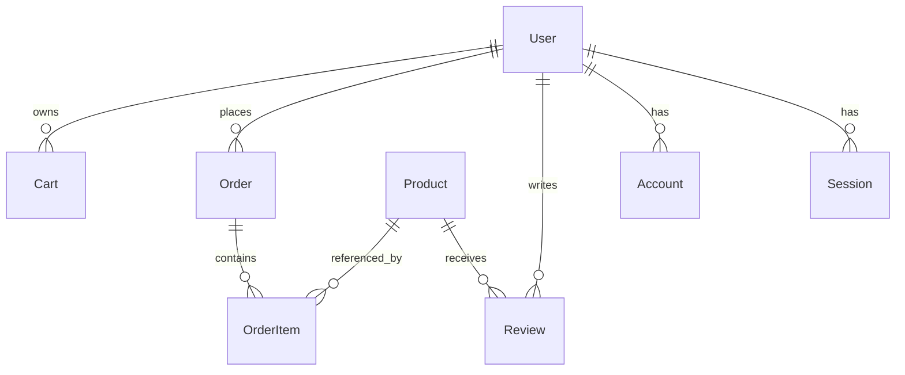
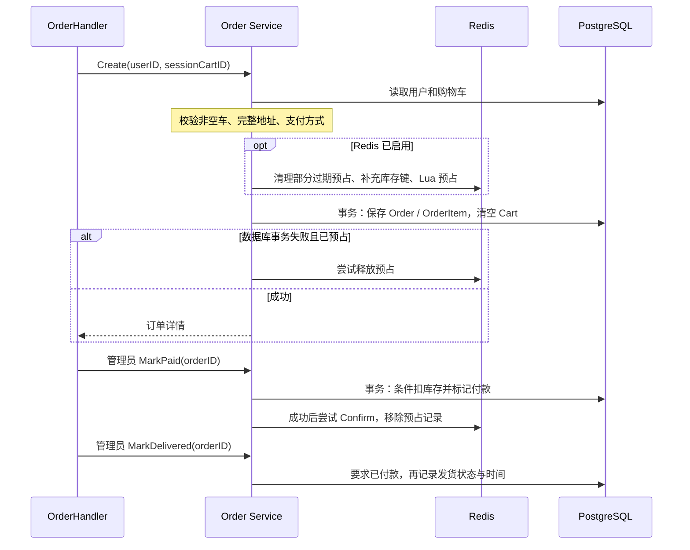
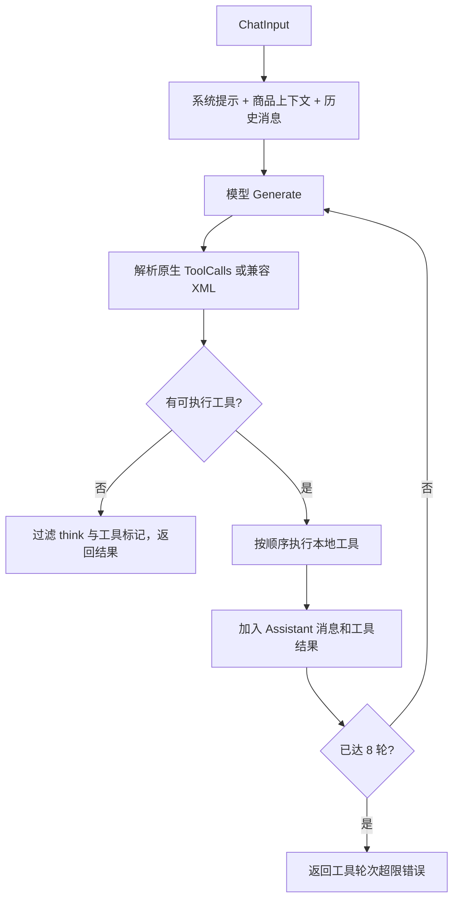
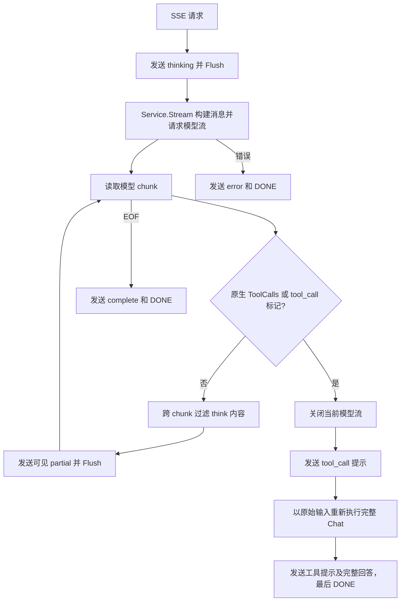
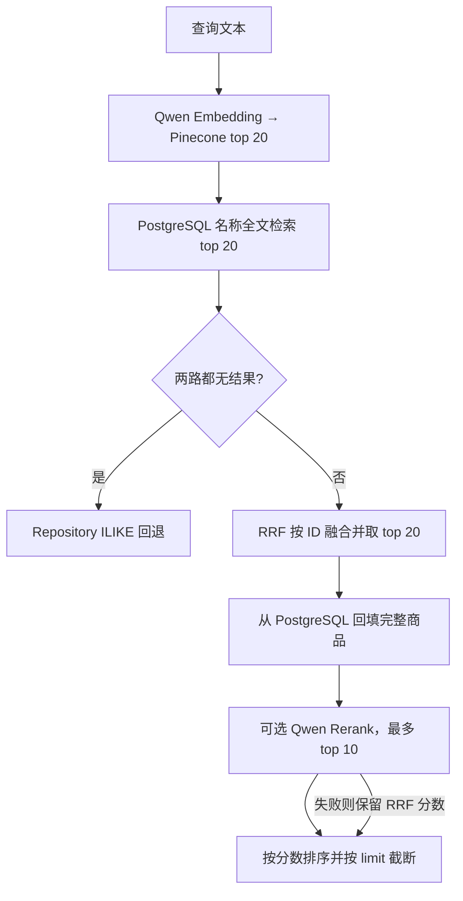

# Mini Store Go 后端技术架构指引

本文面向需要阅读、维护和扩展后端的开发者，按「系统全貌 → 启动与请求 → 业务与存储 → AI 与检索 → 开发与运行」介绍当前实现。

梳理日期：2026-10-03。依据当前工作区源码，文中的“当前行为”与“扩展建议”明确区分；历史讨论、工具名称和配置字段并不代表功能已经实现。接口字段可配合 [OpenAPI](openapi.yaml) 阅读，实际路由与行为以源码为准。

## 1. 系统全貌

后端是一个 Go 模块、一个 HTTP 服务进程组成的电商单体应用。Gin 接收请求，业务服务处理用户、商品、购物车、订单和评价；PostgreSQL 保存业务数据；Redis 提供可选的库存预占。购物助手通过 Eino 的 OpenAI 兼容模型适配器调用外部模型，并通过本地工具访问商品、评价和混合检索服务。



这个项目采用实用的分层结构，但并非严格隔离基础设施的领域架构：模型带 GORM 标签，Repository 接口使用 DTO，部分 Service 识别 `gorm.ErrRecordNotFound`，订单、评价、管理统计和检索直接使用 `*gorm.DB`。阅读时应顺着实际依赖关系，而不是假定所有 SQL 都只存在于 Repository。

### 1.1 技术组件

以下版本来自 [go.mod](../go.mod)，用于说明项目依赖，不表示上游最新版本。

| 组件 | 项目中的作用 |
| --- | --- |
| Go 1.23.0 | 模块声明的 Go 版本 |
| Gin v1.10.0 | 路由、HTTP 绑定、中间件 |
| GORM v1.25.12 + PostgreSQL driver / pgx v5 | ORM、事务、连接池底层驱动 |
| go-redis/v9 v9.7.0 | Redis 连接、Pipeline、Lua 脚本 |
| Eino v0.9.4 + OpenAI component v0.1.13 | 模型消息、工具定义、同步与流式调用 |
| Viper v1.20.0 | YAML、环境变量、默认配置 |
| validator/v10 v10.24.0 | DTO 字段校验 |
| jwt/v5 v5.2.1 | Access / Refresh JWT |
| Zap v1.27.0 | 结构化日志 |
| shopspring/decimal v1.4.0 | 金额、评分的十进制表示 |
| lib/pq v1.10.9 | PostgreSQL 数组类型转换 |

### 1.2 外部依赖的必要性

| 依赖 | 是否必需 | 当前不可用时的行为 |
| --- | --- | --- |
| PostgreSQL | 必需 | DSN 缺失或连接初始化失败，启动失败 |
| Redis | 可选 | 地址为空则禁用；配置了地址但启动 Ping 失败，启动失败；运行期部分库存操作失败会降级 |
| 聊天模型 | 可选 | AI 关闭或缺少 API Key / Model 时模型为空；普通电商 API 可用，聊天返回服务禁用错误 |
| Pinecone / Qwen | 可选 | 向量召回、重排可降级到其他检索路径，不阻止普通业务启动 |

当前没有独立的任务进程、消息队列或定时库存清理进程；AI 对话也没有落入聊天会话表。

## 2. 目录、职责与依赖装配

```text
backend/
├── cmd/api/main.go              # 可执行程序入口
├── configs/config.example.yaml # 配置模板
├── docs/                       # 架构说明和 OpenAPI
├── internal/
│   ├── app/                    # 应用生命周期与资源释放
│   ├── config/                 # 配置结构、加载、环境变量覆盖
│   ├── logger/                 # Zap 构造
│   ├── http/
│   │   ├── router/             # 依赖装配与路由注册
│   │   ├── middleware/         # 请求公共行为和鉴权
│   │   ├── handler/            # HTTP 适配及 presenter
│   │   └── response/           # JSON 响应信封
│   ├── dto/                    # 输入、筛选、分页及 AI 协议
│   ├── validation/             # 输入校验与字段错误转换
│   ├── apperror/               # 业务错误码与错误链
│   ├── auth/                   # JWT 和密码摘要底层能力
│   ├── service/                # auth/user/product/cart/order/review/admin
│   ├── domain/
│   │   ├── model/              # 持久化模型与关系
│   │   └── valueobject/        # 地址、购物项、JSON 与数组转换
│   ├── repository/             # 仓储接口和 Store 聚合
│   │   └── gorm/              # 仓储的 GORM 实现
│   ├── infra/
│   │   ├── database/          # 数据库连接和 AutoMigrate
│   │   └── rediscache/        # Redis 连接与库存协议
│   ├── ai/                    # 模型适配、Agent 循环、工具、内容过滤
│   └── search/                # 混合召回、RRF、重排、回退
├── Makefile
├── Dockerfile
└── go.mod / go.sum
```

模块名是 `mini-store-go/backend`。例如 `mini-store-go/backend/internal/ai` 对应模块根目录下的 `internal/ai`，并不表示要从网络下载一个同名项目。`internal` 包受到 Go 的内部包可见性限制。

### 2.1 两个重要入口

[app.Run](../internal/app/app.go) 负责创建进程级资源；[router.New](../internal/http/router/router.go) 同时承担依赖装配和路由注册职责。项目使用显式构造函数注入，没有 DI 框架。

`repository.Store` 只是 Products、Users、Carts、Orders、Reviews 五个仓储接口的集合，不是事务管理器。`gormrepo.NewStore(db)` 将同一个数据库句柄注入各仓储。

| 服务 | 注入的主要依赖 |
| --- | --- |
| Auth | UserRepository、Token Manager、PasswordHasher |
| User | UserRepository |
| Product | ProductRepository |
| Cart | CartRepository、ProductRepository、StockStore |
| Order | GORM DB、Order/Cart/User/Product Repository、StockStore |
| Review | GORM DB、ReviewRepository、ProductRepository |
| Admin | GORM DB、UserRepository |
| AI | AIConfig、ChatModel、Product/Review Repository、Search Service |
| Search | SearchConfig、GORM DB、ProductRepository、内部 HTTP Client |

扩展一个依赖时，通常需要同时修改服务构造函数和 `router.New` 中的装配代码。

## 3. 启动、配置和退出

### 3.1 启动顺序



入口 [main.go](../cmd/api/main.go) 只调用 `app.Run(context.Background())`，错误最终由 `log.Fatal` 输出。HTTP 服务在 goroutine 中运行，监听错误通过缓冲 channel 返回主流程。收到退出信号后，用独立的 `context.Background()` 派生关闭超时，避免已经取消的父 Context 让优雅退出立即中断。

默认 HTTP 超时是读取 10 秒、写入 180 秒、空闲 60 秒、关闭 10 秒。写入超时较长与 AI 请求有关，但它不等于整个 Agent 流程拥有统一的 180 秒业务 deadline。AI 多轮模型调用和检索会累积耗时。

### 3.2 配置加载规则

来源：[config.go](../internal/config/config.go)、[配置模板](../configs/config.example.yaml)。

1. 写入代码默认值。
2. 按 `./configs`、`./backend/configs`、`.` 搜索 `config.yaml`；找不到配置文件可继续，解析错误则失败。
3. Viper 使用 `MINI_STORE_` 前缀，将配置路径的 `.` 替换成 `_`，例如 `database.dsn` 对应 `MINI_STORE_DATABASE_DSN`。
4. `applyRuntimeEnv` 再执行显式覆盖，因此这些覆盖具有最终优先级。

显式覆盖包括逗号分隔的 `MINI_STORE_CORS_ALLOWED_ORIGINS`、部分 Cookie 设置、`PORT`，以及兼容变量 `PINECONE_API_KEY`、`PINECONE_HOST`、`PINECONE_INDEX`、`QWEN_API_KEY`、`QWEN_BASE_URL`。其中 Qwen Key / Base URL 还会在 AI 对应字段为空时补入聊天配置。`PORT` 必须解析为正整数。

| 配置组 | 重点字段与含义 |
| --- | --- |
| `app` | 名称、环境、监听地址和端口、HTTP 与退出超时 |
| `auth` | Access / Refresh / Password Secret、TTL、Cookie 名及属性 |
| `database` | DSN、AutoMigrate、连接池；默认空 DSN 无法启动 |
| `redis` | 地址、密码、DB、连接池；默认空地址可禁用 |
| `log` | 级别、编码、开发模式 |
| `cors` | 来源、方法、请求头、凭证和预检缓存 |
| `ai` | 开关、API Key、Base URL、Model、Prompt、60 秒模型超时、上下文商品数、温度 |
| `search` | 开关、Pinecone / Qwen 参数、Embedding / Rerank 模型、30 秒 HTTP 超时 |

代码默认 Redis 地址为空，但示例配置为 `localhost:6379`，复制示例后会尝试连接 Redis。`ai.provider` 当前没有驱动选择逻辑，始终构造 Eino OpenAI 适配器；`search.pinecone_index` 当前没有用于查询请求，查询直接使用 `pinecone_host`。

## 4. 一次 HTTP 请求如何流转

### 4.1 中间件顺序

全局注册顺序是：

```text
RequestID → Logger → Recovery → CORS → SessionCartCookie
          → Authenticate → 路由级 RequireAuth / RequireAdmin → Handler
```

`/healthz` 在 `Authenticate` 注册前添加，所以只经过前五项；`/api/v1` 下的路由经过身份识别。CORS 遇到 OPTIONS 会直接返回 204，后续中间件不再执行。

| 中间件 | 当前行为 |
| --- | --- |
| RequestID | 接受请求中的 `X-Request-Id`，不存在则生成 UUID，放入 Gin Context 并写回响应头 |
| Logger | 在 `c.Next()` 后记录方法、路径、query、状态、IP、耗时、响应大小与 request ID |
| Recovery | 捕获 panic，记录堆栈并返回 500 |
| CORS | 匹配允许来源；配置 `*` 时回显请求 Origin；按配置允许凭证 |
| SessionCartCookie | 缺少购物车 Cookie 时生成一年有效期的会话 ID，放入 Gin Context |
| Authenticate | Access Cookie 优先，其次 Bearer；校验 JWT 后查用户表；失败则继续作为匿名请求 |
| RequireAuth | 没有当前用户则返回 401 |
| RequireAdmin | 先要求登录，再检查数据库读出的用户角色是否为 `admin` |

“经过 Authenticate”不等于“必须登录”。商品、购物车、AI 等路由允许匿名访问；登录限制由路由级中间件决定。

### 4.2 Handler、Service、Repository 的分工

以商品详情为例：



Handler 读取路径参数、绑定 JSON / query、执行 DTO 校验、获得当前用户和会话标识，然后调用 Service。Service 负责业务规则和错误转换。Repository 负责查询、保存、关联预加载等持久化细节。Presenter 将持久化模型转换成 API 返回结构。

### 4.3 Context 的贯穿方式

`c.Request.Context()` 从 HTTP 请求传给 Service，再传给 Repository 的 `db.WithContext(ctx)`、Redis 命令、模型调用和搜索 HTTP 请求。这样下游操作可以感知请求取消或上游 deadline；`WithContext` 本身不会自动开启事务，也不会创建新线程。

Gin Context 中的 `current_user`、`session_cart_id` 和 `request_id` 与标准库 `context.Context` 是两个不同容器。当前 RequestID 只通过 `c.Set` 存储，没有自动注入数据库或模型调用的 Context；Service 所需 userID、sessionCartID 是显式参数。

### 4.4 DTO、Presenter 和错误协议

输入结构主要位于 [dto](../internal/dto)，`validate` 标签由 [Validator](../internal/validation/validator.go) 检查。分页通常默认 `page=1, limit=20`，HTTP 输入校验限制 `limit <= 100`；`Normalize` 只补默认值，不负责所有输入合法性检查。

普通成功响应示例：

```json
{"code":"OK","message":"success","data":{"items":[],"meta":{"page":1,"limit":20,"total":0,"total_pages":0}}}
```

[apperror.Error](../internal/apperror/error.go) 包含 `Code / Message / Cause / Details`，保留内部错误链；Handler 只将 message 和 details 输出给客户端。

| 错误码 | HTTP 状态 |
| --- | --- |
| `VALIDATION_ERROR` / `BAD_REQUEST` | 400 |
| `UNAUTHORIZED` / `FORBIDDEN` | 401 / 403 |
| `NOT_FOUND` / `CONFLICT` | 404 / 409 |
| `OUT_OF_STOCK` | 422 |
| `SERVICE_DISABLED` | 503 |
| `INTERNAL_ERROR` 或未识别错误 | 500 |

Presenter 位于 Handler 包中的 `catalog_presenter.go`、`commerce_presenter.go`、`admin_presenter.go`。金额在数据库模型中使用 Decimal，API 商品和订单等响应会转换为 JSON number；多数业务字段为 snake_case，AI 协议中的 `toolName / toolCalls / messageType` 使用 camelCase。不要直接序列化整个 User 模型，以免将密码等内部字段暴露给客户端。

## 5. API 与权限地图

下表除 `/healthz` 外均省略 `/api/v1` 前缀。路由来源为 [router.go](../internal/http/router/router.go)。

| 模块 | 方法与路径 | 权限 |
| --- | --- | --- |
| 健康 | `GET /healthz`；`GET /ping` | 公开 |
| 认证 | `POST /auth/sign-up`、`/sign-in`、`/sign-out`、`/refresh` | 公开路由；refresh 自行检查 Refresh Cookie |
| 身份 | `GET /auth/me`；`GET /users/me` | 登录 |
| 用户资料 | `PUT /users/me`、`/users/me/profile`、`/users/me/address`、`/users/me/payment-method` | 登录 |
| 我的评价 | `GET /users/me/reviews` | 登录 |
| 商品 | `GET /products`、`/products/featured`、`/products/latest`、`/products/categories`、`/products/slug/:slug`、`/products/:id` | 公开 |
| 购物车 | `GET /cart`；`POST /cart/items`；`DELETE /cart/items/:productID` | 游客或登录用户 |
| 评价 | `GET /reviews/product/:productID` | 公开 |
| 评价维护 | `GET /reviews/mine`；`POST /reviews` | 登录 |
| 订单 | `POST /orders`；`GET /orders/mine`；`GET /orders/:id` | 登录；详情还校验所属用户或 admin |
| 管理商品 | `GET/POST /admin/products`；`GET/PUT/DELETE /admin/products/:id` | admin |
| 管理订单 | `GET /admin/orders`；`PUT /admin/orders/:id/pay`、`/admin/orders/:id/deliver` | admin |
| 管理用户 | `GET /admin/users`；`PUT/DELETE /admin/users/:id` | admin |
| 管理统计 | `GET /admin/overview` | admin |
| AI | `POST /ai/chat`；`POST /ai/chat/stream` | 公开 |

目前标记付款是管理员操作，未接入支付网关回调。也没有订单取消、退款或独立混合搜索 HTTP 路由；混合搜索由 AI 工具内部调用。

## 6. 数据模型与持久化约定

### 6.1 核心关系



图中展示主要关系；游客 Cart 的 `userId` 可以为空。`VerificationToken` 独立存在。Account、Session、VerificationToken 被纳入迁移，但当前登录、刷新、注销链路没有使用这些表。

| 模型 | 关键存储设计 |
| --- | --- |
| Product | text 主键、唯一 slug、`text[]` 图片、库存、价格、评分与评价数 |
| User | UUID 主键、唯一 email、密码摘要、role、JSONB 地址、支付方式 |
| Cart | UUID 主键、可空 userId、sessionCartId、`json[]` 购物项、汇总金额 |
| Order | UUID 主键、用户、JSONB 地址快照、支付方式、价格、付款与发货标记 |
| OrderItem | orderId + productId 复合主键，商品名称、价格、图片等下单快照 |
| Review | UUID 主键、用户和商品关联、评分、标题、正文、购买验证标记 |
| Account / Session / VerificationToken | 第三方账号、会话和验证令牌的数据结构，当前没有对应完整业务链路 |

[模型](../internal/domain/model) 显式声明 `TableName()`，实际表名是大小写敏感的 `"Product"`、`"User"`、`"Order"` 等，列也包含 `"createdAt"`、`"userId"` 等 camelCase 名称。手写 SQL 应沿用这些命名并正确引用，不能假设是 GORM 默认的 `products` 或 `user_id`。

### 6.2 值对象与响应边界

`JSON[T]` 实现数据库 `Scan / Value`，用 `Valid` 区分 NULL；`JSONArray[T]` 将每个元素编码为 JSON，再通过 PostgreSQL 数组适配器保存。因此 Cart.Items 的 `json[]` 不等同于单列 JSONB 数组。读取业务值时使用 `.Data`。

金额大多映射为 `numeric(12,2)`，评分为 `numeric(3,2)`。购物车累计金额当前仍经过 float64 再转 Decimal 和四舍五入，因此不能把现状描述为全链路精确十进制运算。

现有 `JSON[T].MarshalJSON` 调用的是 `json.Marshal(j.Value)`，而 `j.Value` 是方法值；直接序列化该包装类型存在错误风险。当前主要 HTTP 输出通过 Presenter 或 `.Data` 解包，新增返回结构也应核对这个边界。

### 6.3 查询和事务

普通商品列表是 `name ILIKE` 名称匹配，支持分类、价格区间、最低评分，排序白名单为价格升序、降序、评分或默认创建时间降序。它没有自动调用向量检索。

仓储按接口需要使用 `Preload`：订单详情加载 OrderItems 和 User，评价列表可加载 User 或 Product。列表通常先 Count 再分页查询。

事务主要在 Service 中通过 `db.WithContext(ctx).Transaction` 定义。事务闭包必须使用传入的 `tx`；直接调用基于原始 db 构造的仓储不会自动加入该事务。当前创建订单、标记付款、评价写入使用这种直接操作 `tx` 的方式。

迁移只有 `AutoMigrate(model.All()...)`，默认关闭；`backend` 内没有版本化 SQL 迁移或种子数据命令。新增结构时，既要修改模型和注册列表，也要设计现有数据如何升级。

## 7. 电商业务链路

### 7.1 注册、登录与会话

注册流程是 DTO 校验 → 检查两次密码 → 邮箱转小写并查重 → 生成密码摘要 → 创建普通用户 → 签发 Access 和 Refresh Token → Handler 设置 Cookie。

当前密码摘要为带配置密钥的 HMAC-SHA256，验证使用常量时间比较；它不是 bcrypt 或 Argon2 形式的慢速密码哈希。修改该实现需要兼顾旧密码数据的验证与迁移。

JWT 签发使用 HS256，包含用户 ID、邮箱、角色、token 类型和时间声明；Access 默认 15 分钟，Refresh 默认 720 小时。身份识别还会查数据库获取用户，因此后续授权依赖用户表中的当前角色。

Refresh 从 Cookie 取刷新令牌，校验后重新查用户并签发一对令牌。SignOut 只清除浏览器中的两个认证 Cookie，没有服务端 Token 撤销或刷新令牌单次消费记录。登录不会立即执行购物车合并；购物车归属处理发生在后续购物车访问或结账中。

### 7.2 购物车

来源：[Cart Service](../internal/service/cart/service.go)。

游客以 `session_cart_id` 寻找购物车；登录后优先取用户购物车，找不到时尝试接管当前会话购物车。已有用户购物车和游客购物车不会合并商品项。

新增购物项每次加一，已有项累加数量；删除接口每次减一，数量为一时移除。读取不存在的购物车返回内存中的空车，首次写入才持久化。加入时读取商品名称、价格、slug、首图作为购物项快照，并检查可用库存；加购本身不执行库存预占。

当前计价规则写在服务常量中：税率 15%；商品金额**大于** 100 时免运费，正数且不超过 100 时运费 10，空车运费为零。结账复制购物车金额与快照，未重新计算全部商品的实时价格。

### 7.3 下单、付款、发货



创建订单不扣 PostgreSQL 的 Product.Stock。付款时对每个商品执行 `WHERE id = ? AND stock >= ?` 的条件更新，用 `stock - qty` 扣减；任一商品不足则整个数据库事务回滚。`MarkDelivered` 要求订单已付款。

顺序重复调用 `MarkPaid` 时，已经付款的订单直接返回；但 `IsPaid` 在事务外读取，没有订单行锁或条件状态更新，不能据此认为并发付款请求已实现严格幂等。

### 7.4 Redis 库存协议与一致性边界

来源：[StockStore](../internal/infra/rediscache/stock.go)、[Order Service](../internal/service/order/service.go)。

| Key | 类型与用途 |
| --- | --- |
| `stock:product:<productID>` | String，可预占库存；用数据库库存执行 SETNX 初始化 |
| `reservation:order:<orderID>` | Hash，保存该订单各商品的预占数量 |
| `reservation:order:expirations` | Sorted Set，订单 ID 对应过期时间戳 |

Reserve 用 Lua 先检查全部商品，再批量扣可用库存、保存 Hash 并写入过期索引；Release 用 Lua 将数量加回并删除预占信息；Confirm 删除预占信息但不增加 Redis 库存，因为付款已使数据库实际库存减少。

预占期为 15 分钟，但没有设置 Redis 自动过期 TTL。后续下单进入 `reserveStock` 时，最多查询并处理 100 条过期记录：已付款订单确认，未付款或不存在的订单释放。因此没有新下单流量时，过期预占可能继续保留，订单本身也不会自动取消。

这是 Redis 与 PostgreSQL 之间的尽力协调机制：库存不足会阻止下单，部分 Redis 连接或补库存错误则放弃预占并继续；订单写入失败会尝试释放，但补偿错误被忽略。数据库与 Redis 没有跨系统原子事务。

另外，SETNX 不覆盖旧库存；管理员修改商品库存没有同步 StockStore，Redis 丢数据后也没有从未付款订单重建预占的流程。最终付款的数据库条件更新可防止单次扣减令库存变负，但缓存漂移、付款并发和补偿失败仍需独立处理。

### 7.5 评价和管理统计

[Review Service](../internal/service/review/service.go) 按 userId + productId 查找并新增或修改评价，在同一个事务内重新聚合平均评分和评价数，再更新 Product。当前模型没有为这两个字段声明联合唯一索引，并发首次评价仍需额外约束。

`IsVerifiedPurchase` 新建时直接设为 true，没有查询用户是否购买过该商品。这个字段当前不能当作已完成购买校验的证据。

[Admin Service](../internal/service/admin/service.go) 聚合订单、商品、用户数量和已付款订单的总销售额；用户管理检查邮箱冲突，禁止管理员删除自己。统计查询是逐条执行的，不保证同一数据库快照。

## 8. AI 模块：模型、工具和流式协议

### 8.1 文件职责

| 文件 | 职责 |
| --- | --- |
| [service.go](../internal/ai/service.go) | ChatModel 接口、消息构造、最多 8 轮工具循环、单次 Stream 入口 |
| [eino_openai.go](../internal/ai/eino_openai.go) | Eino OpenAI ChatModel 的薄适配器 |
| [tools.go](../internal/ai/tools.go) | 工具定义、调用解析、执行、结果回填 |
| [thinking.go](../internal/ai/thinking.go) | 非流式可见内容过滤 |
| [HTTP AIHandler](../internal/http/handler/ai.go) | JSON / SSE 输出、流式过滤、工具调用回退 |
| [AI DTO](../internal/dto/ai.go) | 聊天输入、输出、工具提示、StreamChunk |

服务启动时绑定工具；当前忽略 `BindTools` 返回的错误。模型适配器只封装 `Generate / Stream / BindTools`，Agent 控制循环由本项目自己实现，没有使用 Eino 图编排。

### 8.2 消息构造与普通聊天

每次请求携带 `messages`，支持 user、assistant、system 角色。服务端依次添加配置中的系统提示、相关商品上下文、客户端历史消息。没有服务端对话记忆或历史持久化。

商品上下文取最后一条非空 user 消息，通过普通 ProductRepository.List 做名称模糊查询，默认最多 5 件；失败或无命中时省略上下文。这条自动上下文路径不走混合检索。



原生 ToolCalls 优先于文本 XML；XML 兼容路径识别 `<invoke name="...">` 等结构，并清理 MiniMax 包装标记。执行时仅查找本地注册工具，未知名称被跳过。工具有 call ID 时回填 ToolMessage，否则回填 SystemMessage，再提示模型依据工具结果回答。

最终 `Content` 是可展示文本，`RawContent` 汇集模型原文但标记 `json:"-"`，不会进入普通 JSON 响应；Handler 会记录原文和输入消息到日志。`toolCalls` 是调用提示，不是数据库查询结果全集。

### 8.3 当前工具能力

| 工具 | 实际行为 |
| --- | --- |
| `search_products` | 普通商品筛选；分类下无结果时移除分类重试 |
| `search_products_by_name` | 复用普通搜索实现 |
| `hybrid_search_products` | 调用 Search Service，无结果或失败时回退普通搜索 |
| `get_product_details` | 按商品 ID 查询详情 |
| `get_product_reviews` | 读取评价及用户名称 |
| `get_all_product_names` | 通过 `query=all` 查询商品；名称虽为 all，仍受实际 limit 处理限制 |
| `search_agent` | 普通搜索工具的封装，带专用提示文本 |
| `review_agent` | 评价查询工具封装，未另起模型执行分析 |

这些都是只读工具。`search_agent / review_agent` 并不代表多 Agent 调度；普通搜索的 `method` 参数、评价工具的 `analysis / summary` 参数没有对应分支；`popularity` 也没有独立排序逻辑。混合搜索主路径只使用 query 和 limit，不执行声明中的分类与排序筛选。

当前没有注册 `jump_product_page`。DTO、Service、Handler 中仍保留 navigation 兼容结构，但现有工具没有生成 Navigation 结果，不应将其描述为已启用的跳转能力。

### 8.4 SSE 的实际执行路径

当前 `POST /ai/chat/stream` 已调用 `Service.Stream → ChatModel.Stream`，能逐块输出模型内容。



关键边界：遇到工具意图时，不是在原模型流上续接工具结果，而是关闭流并以原始输入重跑非流式 Chat。这会重新构建上下文，并再次调用模型；回退后的各工具提示是在 Chat 完成后统一输出，不是每个工具开始执行时的实时事件。

| SSE 数据 | 含义 |
| --- | --- |
| `thinking` | 初始等待提示，不是模型推理原文 |
| `partial` | 可见文本增量；回退时可能一次发送完整回答 |
| `tool_call` | 通用查询提示或工具执行摘要 |
| `complete` | 最终完整文本 |
| `error` | 流建立后发生的失败，客户端应解析此事件 |
| `navigation` | 保留分支，当前工具未生成 |
| `[DONE]` | 流结束标记 |

传输格式为 `data: <JSON>\n\n`，结束为 `data: [DONE]\n\n`，没有独立 `event:` 字段。客户端应累积 partial，并用 complete 的完整文本校准最终结果；工具回退前可能已经输出部分文本，不能简单将所有阶段的内容无条件拼接。

HTTP Handler 中的过滤器保留跨 chunk 的 `<think>` 标签片段，隐藏思考内容。非流式 `VisibleContent` 还清理工具标记；两条过滤路径并非完全相同的实现。HTTP 层设置 `X-Accel-Buffering: no` 并 Flush，但代理配置仍需支持持续转发。

## 9. 混合检索与 RAG 数据流

来源：[Search Service](../internal/search/service.go)。这里的 RAG 是检索商品资料后供模型生成答案，不包含训练或商品索引构建流程。



向量和全文检索当前是顺序调用，不是并发召回。向量检索需要 search.enabled、Pinecone Key / Host 和 Qwen Key；关闭 search.enabled 只关闭向量和重排，PostgreSQL 全文检索仍然执行。

全文检索使用 `to_tsvector('english', name)` 和 `websearch_to_tsquery('english', query)`，只检索商品名称，不检索描述，也没有专门中文分词。RRF 使用排名融合：

```text
score(product) = Σ 1 / (60 + rank_in_each_result_list)
```

融合不直接相加向量相似度和 ts_rank 原始分数。Pinecone 命中 ID 必须与 PostgreSQL Product.ID 一致；向量结果只用于召回，商品内容最终从数据库回填，不存在于数据库的 ID 被丢弃。

重排文档拼接 name、brand、category、description。Embedding 地址由 `qwen_base_url + /embeddings` 组成，Rerank 地址则在代码中固定为 DashScope 端点，修改 Base URL 不会修改它。

召回错误被忽略以便降级；两路均无结果时调用普通商品仓储。若召回有 ID 但回填为空，Search Service 返回空结果，AI 混合搜索工具还会再做一次普通搜索回退。排查“搜索无结果”时，需要分别检查索引、数据库回填、全文语言配置和回退命中情况。

当前后端没有商品向量 upsert/delete、索引初始化或商品变更同步流程。新增或修改商品只更新 PostgreSQL，不会自动更新 Pinecone。

## 10. 日志、运行与验证

### 10.1 可观测性现状

访问日志记录请求 ID、路径、query、状态与耗时；panic 日志记录堆栈；AI 完成日志还记录完整输入消息、模型原文和可见文本。当前没有指标导出、分布式追踪或专门的缓存补偿失败统计。

`/healthz` 只检查 db / redis 指针是否非空，返回 ready 或 disabled，没有实时 Ping；`/api/v1/ping` 只返回 pong。数据库启动后断连，健康接口仍可能返回 200，因此不能把它当作完整就绪检查。

### 10.2 本地运行

以下命令在仓库根目录开始执行。先准备 PostgreSQL，并在本地配置中填写 DSN；若不使用 Redis，应将其地址留空。已有 `config.yaml` 时直接编辑，不要覆盖。

```bash
cd backend
# 仅在没有本地配置时复制：
cp -n configs/config.example.yaml configs/config.yaml
go mod download
make run
```

新建本地空数据库可以显式开启 `database.auto_migrate` 创建模型表，但它不会生成商品或管理员。已有数据库应先确认结构，生产升级需要独立评审迁移过程。所有认证密钥和外部服务凭证使用自己的环境配置，不沿用示例占位值。

```bash
# 在 backend 目录执行
make build
make test
# home 下 Go 缓存不可写时可使用：
GOCACHE=/tmp/mini-store-go-gocache go test ./...

# 在服务启动后的另一个终端执行
curl http://localhost:8080/healthz
curl http://localhost:8080/api/v1/products
curl -N http://localhost:8080/api/v1/ai/chat/stream \
  -H 'Content-Type: application/json' \
  -d '{"messages":[{"role":"user","content":"你好"}]}'
```

最后一个请求依赖已配置的 AI 服务。仅运行单元测试不证明真实数据库、Redis 或模型连通。

### 10.3 容器部署

[Dockerfile](../Dockerfile) 使用 Go 1.23 构建器编译 Linux amd64、关闭 CGO，运行阶段使用 distroless static 镜像。构建上下文应是 backend：

```bash
# 仓库根目录
docker build -t mini-store-api ./backend
docker run --rm -p 8080:8080 --env-file /path/to/backend.env mini-store-api
```

环境文件需提供服务实际可达的数据库等连接配置。容器内的 localhost 指向容器自身。Dockerfile 会复制整个 configs 目录到镜像，应避免将含真实密钥的本地 config.yaml 打入镜像。应用支持平台 `PORT` 覆盖监听端口，但容器映射仍需与实际端口一致。

跨站 Cookie 场景需协调 Secure、SameSite、CORS 来源和前端携带凭证；示例配置中的 localhost 不包含 127.0.0.1。AI 还需协调模型、HTTP Server、平台代理的超时；SSE 代理应允许流式转发。

### 10.4 测试覆盖地图

| 测试位置 | 已有覆盖 |
| --- | --- |
| `internal/config/config_test.go` | 配置路径、环境覆盖、CORS / Cookie、平台端口 |
| `internal/app/app_test.go`、`http/router/router_test.go` | 数据库缺失时拒绝初始化 |
| `internal/http/middleware/cors_test.go` | 指定来源及通配来源预检 |
| `internal/ai/thinking_test.go` | think 内容过滤，包括未闭合标签 |
| `internal/ai/tools_test.go` | MiniMax 工具解析、搜索后生成最终回答 |
| `internal/http/handler/ai_test.go` | 假模型的 partial、complete、DONE 输出 |
| `internal/search/service_test.go` | 融合候选的排序 |

当前没有订单与库存并发、真实 PostgreSQL 事务、Redis Lua 补偿或真实外部模型的端到端测试。涉及这些行为的修改应补充对应集成验证，不能只依靠现有单元测试通过。

## 11. 扩展与排查指引

### 11.1 新增一个业务接口

1. 在 dto 定义输入、查询参数和校验规则，明确身份与资源归属要求。
2. 涉及数据结构时修改 model / valueobject，并安排迁移。
3. 在 repository 定义需要的接口，在 repository/gorm 实现查询，持续传递 ctx。
4. 在 service 中实现规则、错误映射和事务；跨表事务应始终使用同一个 tx。
5. 在 handler 绑定输入、调用服务、转换响应；对外字段放在 Presenter 中明确选择。
6. 在 router.New 装配依赖、注册路由及 RequireAuth / RequireAdmin；资源所有权另外校验。
7. 更新 OpenAPI 与相关文档，按行为影响增加服务、HTTP 或集成测试。

不要仅因路径含有 `/admin` 就认为具备权限保护，也不要把 RequireAuth 当作订单所有权校验。现有订单详情的归属校验就在 Handler 中，未来从其他入口复用 Service 时必须处理这层要求。

### 11.2 新增 AI 工具或替换模型

新增工具时，在 tools.go 中定义名称、参数、提示和执行函数，再加入 toolDefinitions。工具读数据应复用仓储或服务，返回有依据的文本；同时验证原生 ToolCalls、XML 兼容解析、工具错误和最大轮数。若工具有写操作，需要单独设计用户身份、授权及重复调用行为，现有只读工具架构没有提供这些保障。

替换模型时实现 ChatModel 三个方法，并修改装配逻辑。仅改变 ai.provider 字符串不会选择新适配器。若希望工具调用也全程流式，需要设计流式 Agent 循环、工具参数增量拼接和事件回调，而不是只修改 DTO。

### 11.3 常见现象的定位入口

| 现象 | 先检查 |
| --- | --- |
| 启动报 database dsn is required | 工作目录、配置搜索路径、MINI_STORE_DATABASE_DSN |
| 本来不需要 Redis 却启动失败 | 示例配置中的 redis.addr；配置了地址就会启动 Ping |
| 请求变成匿名或 401 | Cookie / Bearer 优先级、JWT 过期、Cookie 跨站属性、用户数据库查询 |
| 浏览器失败但 curl 成功 | CORS 精确来源、凭证、Cookie、代理；再检查耗时和超时 |
| 健康检查成功但业务查库失败 | healthz 不做实时依赖探测 |
| 购物车库存和商品详情不同 | Redis 可预占库存、数据库实际库存、管理员库存修改、过期预占清理 |
| SSE 有 thinking 后长时间无正文 | 模型或上下文查询耗时、工具触发回退、代理缓冲、超时 |
| 新商品混合搜索不到 | Pinecone 索引未同步、ID 不一致、全文 english 名称匹配 |
| 搜索 Agent 没有额外推理过程 | search_agent 当前只是普通搜索别名封装 |

### 11.4 当前边界与后续演进

以下是从现有实现得出的维护重点，不表示本项目已经完成这些能力：

| 方向 | 当前边界 | 扩展时的重点 |
| --- | --- | --- |
| 订单一致性 | 无创建幂等键；付款状态在事务外读取 | 并发状态转换、重复结账和支付请求验证 |
| 库存协调 | Redis / DB 尽力补偿；过期清理依赖流量 | 可重试补偿、定时清理、缓存重建和对账 |
| 价格计算 | 下单沿用购物车快照，累计过程使用 float64 | 明确价格锁定规则和 Decimal 全程计算 |
| 评价一致性 | 无用户商品联合唯一约束，购买标记未核实 | 唯一约束、并发聚合与实际购买校验 |
| 认证 | HMAC 密码摘要、无令牌撤销 | 密码格式迁移、会话失效策略 |
| AI 边界 | 公开路由、允许客户端 system 消息、日志保存原文 | 身份与配额、消息信任边界、日志脱敏与留存 |
| 流式工具 | 检测工具后重跑非流式 Chat | 原生流式工具循环、事件时序与 UI 替换语义 |
| 检索同步 | 只有查询，没有向量索引写入流程 | 商品变更同步、重建索引、失败可观测性 |
| 运维 | 指针式健康检查、AutoMigrate、有限测试 | 就绪探测、版本化迁移、业务链路集成测试 |

## 12. 推荐源码阅读路线

第一次阅读可沿以下顺序，把一个完整请求走通，再进入特殊链路：

1. [main.go](../cmd/api/main.go) → [app.go](../internal/app/app.go)：理解进程生命周期。
2. [config.go](../internal/config/config.go) → [router.go](../internal/http/router/router.go)：理解配置和对象如何连接。
3. [ProductHandler](../internal/http/handler/product.go) → [Product Service](../internal/service/product/service.go) → [ProductRepository](../internal/repository/gorm/product.go)：掌握普通分层请求。
4. [认证中间件](../internal/http/middleware/auth.go) → [认证服务](../internal/service/auth/service.go)：理解可选身份识别和强制授权。
5. [Cart Service](../internal/service/cart/service.go) → [Order Service](../internal/service/order/service.go) → [StockStore](../internal/infra/rediscache/stock.go)：理解快照、事务和跨存储协调。
6. [AIHandler](../internal/http/handler/ai.go) → [AI Service](../internal/ai/service.go) → [工具](../internal/ai/tools.go) → [Search Service](../internal/search/service.go)：理解普通聊天、SSE 回退和检索增强。
