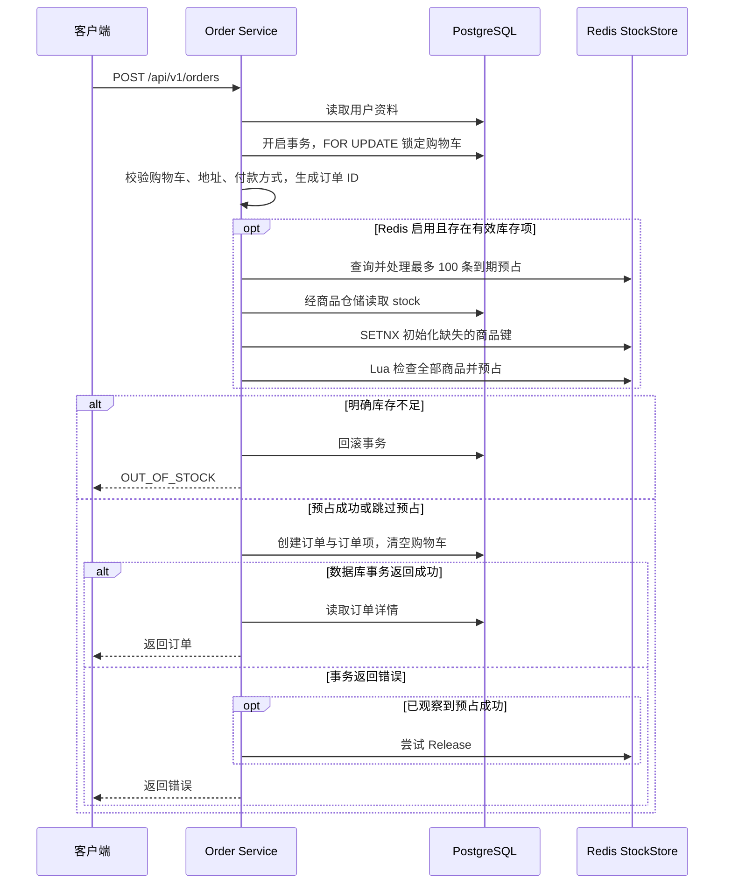

# 旧库存预占链路：实际流程与一致性边界

梳理日期：2026-10-04。

本文保留 3 + 5 实施前的旧链路记录。当前行为见 [本阶段实施说明](order-expiration-inventory-sync.md)。

本文记录当前订单 Service 与 Redis StockStore 的旧链路，作为 [Redis 库存预占与 Saga 一致性技术方案](redis-inventory-saga-design.md) 的阅读基线。Saga 文档中的持久化预占、Outbox、恢复 worker 和 epoch 重建属于待实现设计，不能据此解释旧链路的行为。

核心流程：**下单时扣 Redis 可售量，标记付款时扣 PostgreSQL 实际库存；建单失败或预占到期时尝试恢复 Redis 数量。** Redis 是可选依赖，运行期部分错误会跳过预占继续建单。

## 1. 库存数据与含义

| 数据 | 类型 / 位置 | 含义 |
| --- | --- | --- |
| `Product.stock` | PostgreSQL 商品字段 | 尚未因付款扣减的实际库存；创建订单不扣这个字段 |
| `stock:product:<productID>` | Redis String | 用于加购检查和下单预占的可售数量 |
| `reservation:order:<orderID>` | Redis Hash | field 为商品 ID，value 为该订单预占数量 |
| `reservation:order:expirations` | Redis Sorted Set | member 为订单 ID，score 为预占到期的 Unix 秒时间戳 |

`PrimeStocks` 使用 `SETNX` 将数据库库存写入不存在的 Redis 商品键，过期参数为 0。已有键不会被刷新；预占 Hash 也没有自动过期 TTL。

健康链路中的预期关系是：Redis 可售量 = 数据库库存 − 仍有效的未付款预占数量。旧实现没有数据库预占账本及统一同步机制，故障、过期后付款或后台修改库存都可能破坏这个关系。

以库存 10 件、订单数量 3 件为例，以下付款和释放是两个不同分支：

| 阶段 | 数据库库存 | Redis 可售量 | 订单预占 Hash |
| --- | --- | --- | --- |
| 初始化后 | 10 | 10 | 无 |
| 下单成功，尚未付款 | 10 | 7 | 保存数量 3 |
| 在预占仍有效时付款成功并确认 | 7 | 7 | 删除 |
| 未付款，清理时成功释放 | 10 | 10 | 删除 |

## 2. 加入购物车：只检查，不预占

入口为 [Cart Service.AddItem / availableStock](../backend/internal/service/cart/service.go)。

1. 读取商品。
2. Redis 启用时，尝试 `PrimeStocks`，再读取 Redis 可售量。
3. Redis 禁用、读取失败或键不存在时，使用数据库 `Product.stock`。
4. 检查购物车中该商品增加后的数量，保存购物车及商品快照。

加购不调用 `Reserve`，不扣库存。多个购物车可以同时放入同一件剩余商品，真正的预占竞争发生在下单时。读取购物车本身也不会触发到期预占清理。

## 3. 下单：Redis 预占与数据库建单

HTTP 入口为 `POST /api/v1/orders`，处理器使用当前登录用户和会话购物车调用 [Order Service.Create](../backend/internal/service/order/service.go)。没有请求幂等键，也没有购物车版本检查。



### 3.1 数据库事务内的步骤

1. `loadCheckoutCart` 对购物车加 `FOR UPDATE` 锁，优先查用户购物车，再查可绑定的会话购物车。
2. 校验购物车非空、用户地址完整、付款方式存在。
3. 分配订单 UUID，根据购物车生成订单项快照。
4. 调用 `reserveStock`。
5. 创建订单及订单项，清空购物车并归零金额。
6. 提交成功后，重新读取订单详情返回。

建单和清空购物车在同一数据库事务里。同一购物车的并发结算会等待行锁；前一个请求提交后，后一个请求读到空购物车。这种保护不等同于请求幂等：成功响应丢失后重试，旧链路不会按请求标识返回原订单。

Redis 调用发生在持有购物车行锁的数据库事务内部，但 Redis 不受该事务控制。`primeStockCache` 使用注入的商品仓储读取库存，也没有使用建单事务的 `tx`。

### 3.2 reserveStock 的执行顺序与降级

1. Redis 禁用或没有有效库存项：返回 `(false, nil)`，继续建单。
2. 合并同商品数量，忽略非正数量的库存项。
3. 调用 `releaseExpiredReservations`；清理错误被忽略。
4. 读取商品数据库库存，执行 `PrimeStocks`；失败则跳过预占继续建单。
5. 调用 `Reserve`，期限为 15 分钟；成功返回 `(true, nil)`。
6. 遇到库存键缺失，重新初始化并重试一次。
7. 最终错误为 `ErrInsufficient` 时返回 `OUT_OF_STOCK`，阻止建单；其他错误返回 `(false, nil)`，继续建单。

因此，`reserved == false` 不表示数据库已经完成库存预占。旧链路在这个分支没有建单阶段的最终库存约束。

### 3.3 Reserve Lua

实现位于 [StockStore.Reserve / reserveScript](../backend/internal/infra/rediscache/stock.go)。

1. 第一遍检查所有商品键存在、可售量足够；缺失返回 `-2`，不足返回 `-1`，在正常检查失败路径中没有扣减。
2. 第二遍对商品执行 `DECRBY`，把预占数量写入订单 Hash。
3. 用 `ZADD` 登记订单到期时间，成功返回 `1`。

一次脚本将正常的多商品检查和扣减放在一起执行，避免请求交错造成部分商品缺货时仍扣其他商品。脚本没有检查订单是否已预占，没有请求指纹、终态或取消墓碑；同一订单重复调用可能再次扣减，Hash 中的数量却被覆盖。

### 3.4 建单失败的补偿

`Create` 收到事务错误且 `reserved == true` 时，派生不随原请求取消的 Context，设置 5 秒超时，尝试调用 `Release`。释放错误被忽略，没有持久化重试任务。

旧逻辑也没有区分事务确定回滚和提交结果未知；如果提交成功但返回错误，直接释放可能使数据库订单和 Redis 预占不一致。反过来，Redis 执行成功但响应丢失时，`reserved` 可能仍为 false，无法依据这个内存标志执行补偿。

事务成功之后的订单详情读取若失败，会向客户端返回错误，已提交的订单不会因此回滚，也不会进入上述释放分支。

## 4. 标记付款：扣数据库库存，再确认预占

入口为管理员接口 `PUT /api/v1/admin/orders/:id/pay`，调用 `MarkPaid`。当前没有真实支付渠道回调。

1. 开启数据库事务，对订单加 `FOR UPDATE` 锁。
2. `IsPaid == true` 时直接跳过扣库存。
3. 按商品 ID 顺序查询订单项，逐项执行条件扣减：

   ```sql
   UPDATE "Product"
   SET stock = stock - :qty
   WHERE id = :product_id AND stock >= :qty;
   ```

4. 任一商品更新失败或没有更新到行，整笔数据库事务回滚；商品不足返回 `OUT_OF_STOCK`。
5. 全部成功后，同事务更新 `IsPaid` 与 `PaidAt`。
6. 事务成功后尝试 `Confirm`，再读取订单详情返回。

订单行锁和付款状态检查保护同一订单并发付款不重复扣库存。条件更新避免这一付款扣减令库存变负，多商品缺货时事务避免部分扣减。

`Confirm` 使用普通 Pipeline 执行 `DEL` 预占 Hash 和 `ZREM` 到期索引，不增加或再扣 Redis 数量；这两条命令没有使用 Lua 或事务 Pipeline。付款后的确认错误被忽略。

事务返回 `apperror.Error` 时，代码尝试释放 Redis 预占并返回该业务错误；普通数据库技术错误只返回错误，不释放。付款逻辑不检查预占是否存在或已经到期。

## 5. 到期清理：依赖后续下单流量

`reservationTTL = 15 * time.Minute` 在旧代码中用于计算到期时间，没有用于 Redis `EXPIRE`。

`reserveStock` 在正式预占前调用 `releaseExpiredReservations`：

1. `ExpiredReservations` 使用 `ZRangeByScore` 查询 score 不大于当前 Unix 秒的订单 ID，每次最多 100 条。
2. 逐条通过订单仓储查询数据库。
3. 根据结果调用 `Confirm` 或 `Release`。

| 查询结果 | 处理 |
| --- | --- |
| 已付款 | `Confirm`：删除记录，不恢复数量 |
| 未付款 | `Release`：恢复数量并删除记录 |
| 订单不存在 | `Release` |
| 其他数据库错误 | 跳过，留待后续下单再次处理 |

没有后台定时清理 worker。没有后续下单流量，过期记录会继续保留；一次请求也不保证清空全部积压。清理时的订单查询没有与 `MarkPaid` 共用订单行锁，不能认为到期释放与付款已经互斥。

### 5.1 为什么保留 Hash，用 Sorted Set 记录到期

释放库存需要知道原始商品和数量。单纯让预占 Hash 自动到期，只会删除明细，不会执行库存加回，而且删除后 `Release` 也无法恢复原始数量。

当前实现让 Hash 保存明细、Sorted Set 保存期限，到期后由应用查询订单状态，再决定是否恢复数量。这也可以清理数据库付款成功但 Redis 确认失败留下的记录。

从实现结构看，复用下单请求清理减少了后台任务管理，但代价是清理时间依赖流量，且给下单请求增加额外查询与 Redis 操作。100 条上限限制每次清理批量，没有提供及时释放保证。

### 5.2 Release Lua 与重复调用

`releaseScript` 读取预占 Hash，对每个商品执行 `INCRBY`，再删除 Hash 和到期索引。在记录完整、正常执行的情况下，首次释放后 Hash 消失，重复释放不会再次增加数量。

若 Hash 已不存在，脚本直接返回 0，连对应到期索引也不会移除，可能留下反复被查询的索引。若商品库存键不存在，旧脚本也没有缺失检查，不能把这种情况视为已完成安全重建。

### 5.3 预占到期不等于订单取消

释放只修改 Redis，数据库订单仍保持未付款。旧订单过期后可以继续尝试付款，由数据库库存决定是否成功。

如果预占已经释放，之后付款成功，`Confirm` 只删除记录，无法补扣已经恢复的 Redis 数量。例如库存 10、预占 3、释放恢复到 10 后再付款，数据库变为 7，而 Redis 仍可能为 10。这是旧链路的一致性缺口，不能将过期后付款理解为重新获得了可靠预占。

## 6. 后台修改库存与 Redis 故障

管理员通过 [Product Service.Update](../backend/internal/service/product/service.go) 修改数据库商品库存，没有同步 StockStore。已有 Redis 键不会被 `SETNX` 刷新，因此补货或调减库存后两份数量可能不同。

Redis 地址为空时禁用；配置地址但启动 Ping 失败时，服务启动失败。运行期库存操作的部分失败则按前述规则跳过预占继续建单。

Redis 丢数据后，旧链路按数据库 `stock` 初始化缺失商品键，没有从现有未付款订单重建预占。数据库中也没有专门保存有效预占、执行进度和同步任务。

## 7. 现有保证与待补齐边界

| 场景 | 旧链路的保护 | 边界 |
| --- | --- | --- |
| 并发预占 | 正常 Lua 执行下，统一检查和扣减 | 同一订单重复 Reserve 不幂等；缺少故障恢复 |
| 同一购物车并发结算 | 购物车行锁，建单和清空同事务 | 不提供请求结果幂等；购物车其他修改未统一到同一版本协议 |
| 同一订单并发付款 | 订单行锁，锁内判断 IsPaid | 未与到期清理形成互斥状态转换 |
| 付款库存不足 | 数据库条件更新，多商品事务回滚 | 不保证已接受的所有未付款订单都能付款 |
| 建单失败后释放 | 已观察到预占成功时尝试补偿 | 补偿错误被忽略，未知结果和进程崩溃缺少恢复 |
| 库存同步 | 缺失键 SETNX 初始化 | 补货、缓存丢失及过期后付款可能产生漂移 |

已有订单集成测试覆盖并发付款只扣一次、多商品缺货回滚、同一购物车并发结算只消费一次；Redis 集成测试覆盖正常多商品预占和重复释放。订单测试注入的 StockStore 为 nil，不能把这些测试视为整个 Redis 与数据库故障链路的验证。

[后端架构指引](../backend/docs/architecture-guide.md) 中关于付款状态在事务外读取、缺少订单行锁及缺少相关集成测试的描述与本次源码基线不一致。阅读旧库存链路时以实际函数和测试为准。

## 8. 代码阅读索引

行号对应本文梳理时的版本，后续修改后应按函数名定位。

| 文件 | 函数 / 位置 | 阅读重点 |
| --- | --- | --- |
| [订单服务](../backend/internal/service/order/service.go) | 常量，第 23 行 | 15 分钟期限、100 条清理上限 |
| 订单服务 | `Create`，第 47 行 | 事务内预占、建单、清空购物车及失败补偿 |
| 订单服务 | `MarkPaid`，第 135 行 | 订单锁、条件扣库存、确认或释放 |
| 订单服务 | `loadCheckoutCart`，第 204 行 | 购物车行锁 |
| 订单服务 | `reserveStock`，第 241 行 | 清理、初始化、预占、重试和降级 |
| 订单服务 | `releaseExpiredReservations`，第 307 行 | 已付款确认，未付款或不存在则释放 |
| [Redis 库存](../backend/internal/infra/rediscache/stock.go) | `PrimeStocks`，第 46 行 | 永久 SETNX 初始化 |
| Redis 库存 | `Reserve`，第 79 行 | 到期时间与 Lua 参数 |
| Redis 库存 | `Confirm`，第 120 行 | Pipeline 删除记录，不恢复库存 |
| Redis 库存 | `ExpiredReservations`，第 131 行 | Sorted Set 到期查询 |
| Redis 库存 | `reserveScript`，第 182 行 | 全商品检查、DECRBY、HSET、ZADD |
| Redis 库存 | `releaseScript`，第 210 行 | HGETALL、INCRBY、DEL、ZREM |
| [购物车服务](../backend/internal/service/cart/service.go) | `AddItem` / `availableStock` | 加购只检查，Redis 故障时回退数据库库存 |
| [商品服务](../backend/internal/service/product/service.go) | `Update` | 后台更新未同步 Redis |
| [订单测试](../backend/internal/service/order/service_test.go) | 三个集成测试 | 并发付款、缺货回滚、并发结算 |
| [Redis 测试](../backend/internal/infra/rediscache/stock_test.go) | 两个集成测试 | 多商品检查、并发预占及重复释放 |
