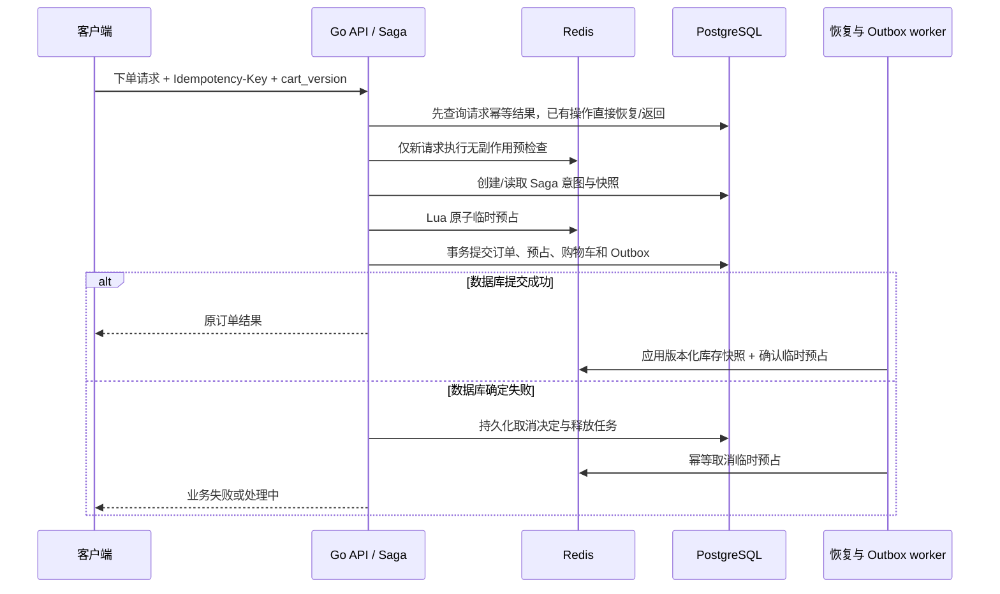

# Redis 库存预占与 Saga 一致性技术方案

日期：2026-10-04

状态：待实现技术设计；本文不表示相关功能已落地。

范围决定（2026-10-04）：用户要求本阶段只实现订单到期关闭、补货同步与 Redis 重建，其余边界 case 暂不考虑。实际实现和延后事项见 [本阶段实施说明](order-expiration-inventory-sync.md)。本文完整 Saga / Outbox / epoch 设计保留为未来参考。

分支：`codex/redis-inventory-saga-design`

实际代码基线：`43bc84b`，仍使用 Redis 库存层。`35f4ff1` 不在当前分支历史中，不作为实施前提。

## 1. 目标与架构决定

保留 Redis 对高并发请求的快速库存判断和原子预占，用 PostgreSQL 保存订单、持久化预占、Saga 进度和同步事件。采用应用内编排式 Saga：正向操作和补偿都可重复执行，进程重启后可以继续处理。

核心原则：Redis 决定是否进入下单后续流程；PostgreSQL 决定是否真正接受订单。Redis 预占成功不等于下单成功，只有数据库事务提交成功，才对用户返回成功。

数据库保留库存最终校验，允许 Redis 在故障时短暂偏高或偏低，但不允许偏差导致数据库成功接受超额预占。事件同步恢复后的 Redis 数值必须收敛到数据库事实。

第一阶段不引入独立消息队列、独立事务协调器或 Raft 集群。使用数据库 Outbox、后台 worker、Lua 脚本和显式状态机实现可恢复流程。以后拆分服务时可替换编排基础设施，保留请求 ID、预占状态和事件契约。

### 1.1 为什么选 Saga

当前订单与库存代码位于同一个 Go 服务，旧流程已经是“Redis 预占 → 数据库建单 → 失败释放”的补偿流程。主要缺口是持久化决策、幂等、重试及异常恢复，适合用 Saga 补齐。

TCC 的资源预留概念仍可用于库存操作，但完整的分支 Try/Confirm/Cancel 协议不是本阶段的必要条件。Saga 本身不提供跨步骤隔离，本文通过数据库库存约束、订单状态和原子预占提供业务层保护。

Raft 保障复制状态机的副本一致性，不能直接使 Redis 与 PostgreSQL 双写原子化。普通 Redis 的故障切换仍可能丢失已确认写入，所以最终防超卖必须有数据库约束。

### 1.2 性能与适用范围

- Redis 过滤大量库存不足请求，避免这些请求进入数据库建单事务。
- 所有成功订单仍需数据库写入和商品行锁；本方案不能承诺热点商品成功下单无限扩展。
- 下单前先限流，再做无副作用的 Redis 可售量预检查；明显缺货请求可以直接拒绝。只有候选请求创建持久化 Saga 意图，再执行真正的原子预占。
- 预检查和 Lua 结果可能因同步滞后保守拒绝，接受短暂少卖；不通过逐请求查询数据库掩盖缓存滞后，使用后台同步和监控修复。
- MVP 所有库存 key 使用一个 Redis Cluster hash tag，支持多商品一次 Lua 全有或全无预占；这限制了库存写路径的水平扩展，后续分片另行设计。

## 2. 现有实现的问题与保留项

当前 `backend/internal/infra/rediscache/stock.go` 使用永久 `SetNX` 初始化库存，Lua 扣减并保存订单预占；付款后删除预占记录，过期清理由后续下单触发。

需要解决的问题：

1. 后台补货或调减库存只更新 PostgreSQL，Redis 已存在的 key 不会刷新。
2. Redis 操作和 PostgreSQL 建单没有共同事务；失败释放可能失败，当前部分错误被忽略。
3. `Reserve` 重试没有完整的请求状态保护，可能重复扣减；迟到的预占可能发生在取消之后。
4. 付款提交结果未知时，不能凭网络错误直接释放预占。
5. 过期释放依赖业务流量，缺少可靠 worker。
6. Redis 重启、故障切换、补货同步和缓存重建缺少统一恢复协议。
7. 当前 Lua 访问动态拼接的 key 和固定过期集合，不能直接作为 Redis Cluster 多 key 原子操作的实现。

保留 `43bc84b` 的订单锁与购物车锁。同一订单重复付款只扣一次库存，同一购物车并发消费只建一笔订单。在此基础上新增请求级幂等：同一请求重试返回原订单或原失败结果。

## 3. 库存定义和不变量

| 名称 | 含义 | 权威存储 |
| --- | --- | --- |
| physical | 尚未因付款扣减的实物库存，沿用 `Product.stock` | PostgreSQL |
| reserved | 已成功建单、仍处于 ACTIVE 状态的持久化预占总量 | PostgreSQL |
| db_available | `physical - reserved` | PostgreSQL |
| base_available | Redis 最近应用的 `db_available` 快照 | Redis 投影 |
| pending | 尚未由数据库决定或尚未完成投影确认的临时预占量 | Redis |
| redis_available | `base_available - pending` | Redis 快速判断 |

必须成立：

- 数据库始终满足 `physical >= reserved >= 0`。
- 一笔成功订单的所有商品预占、订单记录、清空购物车和 Outbox 事件一起提交。
- `ACTIVE → CONSUMED` 时同时减少 physical 和 reserved；`ACTIVE → RELEASED` 时只减少 reserved。
- 订单预占只能消费一次或释放一次，终态不可逆。
- Redis 临时预占重复执行不会重复冻结；重复释放不会重复恢复。
- Saga 数据库提交与取消决定互斥，通过同一 Saga 行锁保护。
- 网络超时表示结果未知，不表示操作没有执行。
- Redis 结果不能替代数据库最终约束；数据库不可用时无法创建成功订单。

## 4. 总体流程



Redis 外部调用不放在持有数据库行锁的事务内。HTTP 处理器和 worker 调用同一套 Saga 服务；HTTP 请求断开后，worker 仍能根据持久化意图继续或取消。

## 5. PostgreSQL 数据模型

以下为逻辑模型；实施时用版本化 SQL 迁移，并与现有 GORM 引号列名保持一致。

### 5.1 商品库存

给 `Product` 新增：

- `reserved_stock bigint NOT NULL DEFAULT 0`。
- `inventory_revision bigint NOT NULL DEFAULT 0`。
- 约束：`stock >= 0`、`reserved_stock >= 0`、`stock >= reserved_stock`。

所有库存写入都锁定商品行，并增加 revision。库存变化包括建单预占、付款、取消、过期、补货和库存盘点；普通商品描述编辑不变更库存 revision。

revision 在商品行锁内生成；不使用应用时间戳排序。Lua 比较 revision 时避免大整数转换成浮点数，采用十进制字符串的长度与字典序比较。

### 5.2 持久化预占

新增 `inventory_reservations`：

| 字段 | 说明 |
| --- | --- |
| id / order_id / saga_id | UUID；order_id、saga_id 各自唯一 |
| state | ACTIVE、CONSUMED、RELEASED |
| expires_at | 数据库时间起算，建单后 15 分钟 |
| released_reason | EXPIRED、CANCELLED 等 |
| created_at / updated_at | 审计时间 |

新增 `inventory_reservation_items`，以 `(reservation_id, product_id)` 为主键，记录正整数 qty，并建 product_id 查询索引。数量来自服务器购物车快照，不信任客户端价格或数量。

reserved_stock 等于全部 ACTIVE 项数量之和。过期到达时，worker 通过数据库事务将 ACTIVE 改为 RELEASED，再减少计数。worker 延迟期间可能少卖，但不能为了提早放行只在 Redis 中释放。

### 5.3 Saga 意图

新增 `order_sagas`：

- `id`、预先分配的 `order_id`、`user_id`、`idempotency_key`。
- `request_hash`：规范化后的客户端请求语义，包括 user_id、cart_id、expected_cart_version；首次处理保存服务器商品、地址和付款方式快照。
- `cart_id`、`cart_version`、不可变 `items_snapshot`、`shipping_snapshot`、`payment_method`。
- `state`、`failure_code`、`failure_message`。
- `inventory_epoch`、`attempt_deadline`（默认 60 秒）、`next_retry_at`、`retry_count`。
- `lease_owner`、`lease_until`、递增 `lease_generation`。
- `created_at`、`updated_at`。

唯一约束 `(user_id, idempotency_key)`。相同 key、不同 request_hash 返回 409。重复请求先读取已有 Saga，不能重新读取已清空购物车后把同一请求误判为另一个请求。首次快照固定，后续 worker 复用快照。完整快照可按保留期归档，但 key、请求摘要、结果标识和过期标记保留为紧凑墓碑，避免清理后同一 key 被重新执行。

### 5.4 Outbox

新增 `inventory_outbox`：event_id、saga_id/操作 ID、epoch、payload、status、retry_count、next_retry_at、lease_owner、lease_until、lease_generation、created_at。

payload 包含每个商品的 `{product_id, revision, db_available}`，以及本次 Saga 对应的临时预占终态指令。多商品创建事件包含整笔订单商品列表。

库存变化和 Outbox 插入在同一数据库事务提交。worker 至少一次投递；重复消息由 Lua 状态及 revision 去重。收到 Redis 成功响应后才标记事件已投递，响应未知则重试。

### 5.5 购物车、订单、恢复控制

- Cart 新增 version。所有增删商品、合并购物车、绑定用户及清空操作统一在行锁内处理并递增 version，避免事务外读出的旧购物车覆盖新数据。
- Order 新增业务状态 UNPAID、PAID、CANCELLED、EXPIRED，保留 IsPaid 等字段兼容现有响应。状态字段与现有布尔字段在同一事务更新。
- 新增 `inventory_control` 单行：epoch、mode（NORMAL/REBUILDING）、重建租约与 generation。epoch 存在 PostgreSQL，Redis 丢失时不能自行初始化为旧值。
- 正常库存写事务对 control 行加共享锁并检查 mode；重建以排他锁修改控制状态。这允许正常事务并发，同时阻止重建快照期间发生库存写入。

## 6. Saga 与 Redis 状态机

### 6.1 数据库 Saga 状态

| 状态 | 含义 | 后续 |
| --- | --- | --- |
| PREPARED | 意图及快照已持久化，Redis 结果尚未确认 | 重试预占、数据库提交或决定取消 |
| REDIS_RESERVED | 已观察到 Redis 临时预占成功 | 数据库提交或决定取消 |
| DB_COMMITTED | 订单及持久化预占已提交 | 投递 Outbox，推进 DONE |
| DONE | Redis 已确认投影完成 | 返回原订单 |
| CANCEL_DECIDED | 数据库已禁止本 Saga 建单 | 幂等释放 Redis |
| CANCELLED | 释放已确认，或旧 epoch 已整体作废 | 返回保存的失败结果 |

PREPARED 不证明 Redis 未执行。REDIS_RESERVED 的状态更新丢失后，也可以从 Redis 同一 saga_id 的记录恢复结果。

DB_COMMITTED 是不可补偿的下单成功决定；缓存同步失败采用向前恢复。订单之后的取消/到期是独立业务事务，不能回退 Saga 来实现。

### 6.2 Redis 临时预占状态

`NONE → PENDING → DB_ACKED`，或者 `NONE/PENDING → CANCELLED`。DB_ACKED 与 CANCELLED 为互斥终态。

DB_ACKED 表示该请求已经投影进数据库库存快照，临时 pending 不再额外计数；持久化的订单预占仍包含在 base_available 中。付款消费对应数据库持久化预占，不能误把 DB_ACKED 当作订单已付款。

允许取消脚本为不存在的请求建立 CANCELLED 墓碑，禁止迟到的 Reserve 重新冻结。活跃 PENDING 记录不设置自动 TTL；终态清理遵循重试保留期和 epoch 规则。

## 7. Redis 模型及 Lua 契约

### 7.1 Key 布局

MVP 统一使用 `{inventory-0}`：

```text
inventory:{inventory-0}:control                  epoch、mode
inventory:{inventory-0}:e:<epoch>:product:<id>   base_available、revision、pending
inventory:{inventory-0}:e:<epoch>:attempt:<id>   request_hash、items、state、deadline
inventory:{inventory-0}:e:<epoch>:pending         请求超时索引 ZSET
```

所有脚本使用的 key 显式放入 KEYS，并在同一 hash slot。单商品与多商品均原子检查所有项后再更新。脚本在第一次写入前校验 key 类型、参数、数量、epoch 和请求指纹；Lua 原子执行不等于运行出错后自动撤销此前写入。

多商品订单不能直接改成各 SKU 独立 hash tag 后还声称整笔 Lua 原子性。未来跨分片需逐分片子预占、持久化子步骤与补偿，并单独设计可用性和死锁避免策略。

### 7.2 Reserve

输入：epoch、saga_id、request_hash、商品数量列表、attempt_deadline。

1. control 必须存在，mode 必须 NORMAL，epoch 必须匹配；商品缓存缺失返回 NOT_READY，不能按 0 或数据库物理库存随意初始化。
2. 已存在相同 PENDING/DB_ACKED 返回原结果，不再次扣 pending；不同指纹返回冲突；CANCELLED 返回终态失败。
3. 校验每个商品 `base_available - pending >= qty`。
4. 一次性增加全部商品 pending，保存 PENDING 记录和超时索引。

Redis 超时后重试相同 saga_id。不能生成新 saga_id，也不能把超时当作没预占。

### 7.3 ApplyProjectionAndAck

输入：epoch、商品快照列表、可选 saga_id 和其终态 DB_ACKED。

一次 Lua 内完成：

- 对每个商品，只应用 revision 更大的 base_available 快照，保留其他请求的 pending。
- 若指定的请求仍为 PENDING，按其原始数量从对应商品 pending 移除，改为 DB_ACKED。
- 不存在该请求时也写入 DB_ACKED 墓碑，防止丢失旧记录后迟到的 Reserve 重新扣减。
- 重复 ACK 不重复移除 pending；已 CANCELLED 与 DB_ACKED 冲突时报警并停用该商品受理，不能猜测修复。
- 多商品 Saga 的 ACK 要与整组快照在同一次脚本内执行，不能只确认部分商品。

乱序例子：Saga A、B 都已提交，但 B 的新 revision 先到。新 base 已包含 A、B 的数据库预占；先移除 B 的 pending，A 暂时额外冻结一次，造成保守少卖。A 的旧事件稍后到达时不覆盖 base，但仍移除 A 的 pending，恢复准确值。

不能仅凭事件 revision 旧就跳过整条事件，否则 A 的 pending 永远无法解除。反过来，不能在尚未应用包含 A 提交结果的快照时单独移除 A 的 pending，否则可能放大可售量。

### 7.4 CancelPending

输入：epoch、saga_id、原始指纹和商品列表。只有数据库 CANCEL_DECIDED 的持久化任务可以调用。

- PENDING：减去原始 pending，转 CANCELLED。
- NONE：创建 CANCELLED 墓碑，禁止晚到的 Reserve。
- CANCELLED：成功返回，不修改数值。
- DB_ACKED：返回冲突，禁止恢复库存。

补偿不执行无条件 INCRBY，也不按最新购物车内容计算数量。缓存商品缺失、pending 计数异常、epoch 不匹配时走重建/查询控制状态，不创建缺失库存 key。

## 8. 下单流程

### 8.1 接口与准备

`POST /api/v1/orders` 要求 Idempotency-Key，body 增加 cart_version。前端一次结算操作生成一个 key，网络重试持续复用；用户开始新的结算操作才生成新 key。

首先查询 `(user_id, idempotency_key)` 的已有操作，存在则恢复或返回原结果，不再经过可售量预检查。否则，成功订单重试时可能因库存已经用尽被错误拒绝。

仅新请求执行 Redis 预检查，然后准备事务校验用户、购物车归属及预期版本，读取服务器快照、验证数量与地址，创建 Saga 意图。并发插入同一 key 时依靠唯一约束读取获胜者，复用同一 saga_id。可用量预检查只是快速拒绝，不能代替正式 Lua 与数据库校验。这个顺序仍有一次幂等结果的数据库读取；高比例缺货流量主要节省建单事务，而不是消除所有数据库访问。

### 8.2 正向执行

1. 领取 Saga 租约，检查尚未取消且未超过 attempt_deadline。
2. 不持有数据库行锁时调用 Reserve。
3. 预占成功后，执行建单数据库事务：control 共享锁 → Saga 行锁 → Cart 行锁 → 按 product_id 排序锁定所有商品。
4. 校验租约 generation、Saga 状态、epoch、deadline 与购物车版本。购物车发生改变则确定失败，保留当前购物车并补偿 Redis。
5. 对每个商品校验 `stock - reserved_stock >= qty`，然后增加 reserved_stock 与 revision。
6. 创建订单及 ACTIVE 预占，expires_at 使用数据库时间加 15 分钟，清空并递增购物车版本。
7. 同事务写 Outbox，并把 Saga 改为 DB_COMMITTED。
8. 提交后返回订单；可以立即尝试投影，但 HTTP 成功不依赖 Redis 投影已经完成。

### 8.3 失败、取消和未知结果

数据库明确业务失败时，另开短事务锁定 Saga：如果已 DB_COMMITTED，返回原订单；否则写 CANCEL_DECIDED、保存错误，并插入释放任务。随后幂等补偿。

提交返回超时/连接中断时，重新按 saga_id 查询。无法访问数据库则保留未知状态，不调用释放。worker 恢复时先锁定 Saga；若数据库已经提交则向前同步，若未提交且已超时则原子决定取消。并发恢复者必须通过相同 Saga 行锁互斥。

lease 过期只是可以被接管，不是事务自动失败。旧 worker 的数据库写入须校验 generation；迟到的 Redis Reserve 依靠同一 attempt 的幂等记录/取消墓碑及 epoch 防护。数据库取消后，未完成的 Redis RPC 必须通过释放重试或 epoch 重建收敛。

## 9. 付款、取消、到期及补货

### 9.1 付款

control 共享锁 → Order 行锁 → reservation 行锁 → 商品按 ID 排序加锁。

- 已 PAID 返回原结果。
- CANCELLED、EXPIRED、预占已 RELEASED 或 expires_at 已到，拒绝付款，用户重新下单。本阶段明确采用过期订单不可再付的业务规则，与旧实现允许超时订单尝试付款不同。
- ACTIVE 未到期：同事务将 stock 和 reserved_stock 各减少 qty，预占改 CONSUMED，订单改 PAID，增加 revision，写投影 Outbox。
- 数据库回滚后保持原 ACTIVE 预占；不得因为一次付款技术失败释放它。
- 数据库成功、Redis 不可用：返回已付款，后台同步；不补偿真实付款。

当前项目是管理员 MarkPaid 标记付款，没有真实支付渠道。如果以后接支付回调，需额外处理“钱已收但订单过期”的退款/人工处理流程，不能直接套用拒绝付款返回值。

### 9.2 取消与到期

定时 worker 从数据库领取候选订单，每个订单用上述相同锁顺序处理。ACTIVE 且 UNPAID 时减少 reserved_stock，改为 RELEASED，订单改 CANCELLED/EXPIRED，并写 Outbox。

与付款并发时，由订单行锁决定顺序；付款获得锁后还需再次用数据库时钟检查期限。到期以数据库时间为准，不依赖客户端时间、Redis key TTL 或 keyspace notification。

worker 滞后时 reserved_stock 暂未恢复，允许保守拒绝；暴露过期处理延迟指标。Redis 的临时 attempt 超时只触发 Saga 恢复，不直接释放已被数据库接受的订单预占。

### 9.3 补货、盘点和删除

库存写入统一经过 InventoryService，锁商品、检查新 stock 不小于 reserved_stock、增加 revision 并写 Outbox。

新 stock 小于 reserved_stock 返回 409。补货提交后数据库立即生效，Redis 在 Outbox 投影后生效；管理员界面显示同步中/同步失败，不能承诺跨系统瞬时同步。

明确区分“补货增加 delta”和“盘点设置绝对值”。delta 操作使用唯一操作 ID；绝对值操作使用 expected_revision 防止覆盖并发付款结果。商品非库存字段更新不能使用带旧 stock 的全模型 Save。

存在有效预占或历史订单引用的商品不能物理删除，采用下架/软删除；对应 Redis 可售投影禁止新预占。

## 10. Worker、重试与保留规则

worker 分为 Saga 恢复、Outbox 投影、订单到期、库存对账四类。进程启动后运行，SIGTERM 停止领取新任务；已领取任务完成短事务后退出，未完成者等待 lease 到期接管。

领取采用 `FOR UPDATE SKIP LOCKED` 的短事务，更新 owner、lease_until、generation 后立即提交；不能在持有任务行锁时等待 Redis 网络调用。确认任务完成时条件更新 owner/generation，阻止旧 worker 覆盖新 worker 结果。

初始建议值（配置项，不是压测结果）：

| 参数 | 默认建议 |
| --- | --- |
| Redis RPC 超时 | 200 ms，按部署 RTT 调整 |
| HTTP 同步等待预算 | 3 秒 |
| Saga 准备执行期限 | 60 秒 |
| 订单预占期限 | 15 分钟 |
| worker lease | 10 秒，长操作续租 |
| Outbox / 到期轮询 | 200 ms / 1 秒 |
| 重试退避 | 100 ms 起步，指数退避至 30 秒，加随机抖动 |
| 请求幂等结果保留 | 至少 7 天 |

失败连续重试到阈值后进入 NEEDS_ATTENTION 告警；释放和投影任务不能因为达到次数上限静默删除，允许人工修复后继续重试。

活跃 pending 无自动 TTL；同一有效 epoch 内保留 Redis 终态墓碑，不能仅凭经过 7 天就删除后允许迟到 RPC 重新执行。需要回收时进行受控 epoch 切换，使旧命令失效，再清理旧代 key。

数据库完整请求结果至少保留 7 天，之后保留紧凑 key 墓碑，旧请求返回幂等窗口过期而不能重新执行。只有确认无活跃任务和未投递事件后才可归档明细；过期 epoch 的 key 可整体异步清理。

## 11. Redis 故障、重建与对账

### 11.1 正常故障策略

Redis 不可用时停止新增下单，返回 503 或已创建 Saga 的 202；不沿用旧逻辑跳过预占直接成功。已存在订单付款、取消可以继续走数据库，Outbox 累积等待恢复。

Redis 故障切换可能丢失写入；即使尚未被探测，数据库约束仍阻止超额订单成功。监测控制 key 缺失、epoch 缺失、负计数、主节点变化及积压，触发重建。

### 11.2 安全重建

1. 重建者领取数据库恢复租约；以 control 排他锁切换 REBUILDING。排他锁等待先前正常库存事务结束，后续库存写事务检查 mode 并退出/等待。
2. 提升 epoch，初始化 Redis 新代 control 为 REBUILDING。所有旧 RPC 都必须携带旧 epoch，无法写入新代数据。
3. 在数据库 control 保持 REBUILDING 期间，将尚未 DB_COMMITTED 的旧代 Saga 决定取消；它们不能恢复建单。数据库已接受订单的 ACTIVE 预占保留。
4. 读取一致数据库快照，写入每个商品的 db_available/revision；新代 pending 全部为 0，不复制旧 Redis 计数。
5. 旧代 Outbox 的数据库事实已经包含在全量快照中，记录覆盖标记后完成旧事件；禁止仅凭 epoch 不同丢弃尚未证明被快照覆盖的事件。
6. 完整校验数量、revision、抽样预占和库存约束。先把 Redis 新代切换 NORMAL，再将数据库 control 改 NORMAL。期间数据库仍禁止新代库存写入，避免发布窗口竞态。
7. 失败继续保持 REBUILDING，新的恢复者按 generation 接管；重建后清理旧代 key。

重建期间库存写入短暂停顿，包括付款状态更新，接口显示处理中并重试。普通 Redis 短暂不可用但不需重建时，既有订单可继续数据库操作；两种情况不能混为同一可用性承诺。

### 11.3 周期性对账

- 数据库对账：检查 reserved_stock 是否等于 ACTIVE 明细和，检查库存约束；发现异常时先阻断该商品受理，再在锁下修复，增加 revision 和 Outbox。
- Redis 对账：对比 base_available/revision 与数据库；保留 pending，用版本化快照修正 base，不覆盖整个可售计数。
- pending 对账：按 saga_id 查询数据库状态，分别 ACK、取消或继续执行；记录不存在时报警，禁止猜测恢复 qty。
- 在线对账不能把数据库旧快照覆盖新 revision；系统性不一致使用完整 epoch 重建。

## 12. API 与前端约定

| 情况 | 响应 |
| --- | --- |
| 下单数据库已提交 | 200，返回原 order_id 与订单 |
| 同一 key 正在处理或提交结果未知 | 202，返回 saga_id、状态查询地址、建议重试间隔 |
| 同一 key 请求语义不同、购物车版本冲突 | 409 |
| 库存不足 | 沿用 OUT_OF_STOCK / 422 |
| Redis 停止受理且没有已持久化操作 | 503 |

新增 `GET /api/v1/order-operations/:saga_id`；仅本人或管理员可查，不能泄露其他用户快照。查询返回 PREPARING、COMMITTED、FAILED 等产品状态，而不是暴露数据库 worker 实现细节。

购物车响应新增 version。前端 202 时继续轮询同一操作，不能展示失败后立刻用新 key 重复下单。失败时保留购物车；成功时按服务器结果刷新订单和购物车。

## 13. 故障矩阵与可观察性

| 故障点 | 正确处理 |
| --- | --- |
| 意图写入前进程崩溃 | 没有副作用；原 key 可以重试 |
| Redis 已预占，但响应丢失 | 同一 attempt 重试/查询，不重复扣减 |
| Redis 预占后进程崩溃 | 数据库 Saga 恢复；继续提交或持久化取消 |
| 建单事务确定回滚 | 持久化取消；可靠补偿临时 pending |
| 数据库提交响应丢失 | 查 Saga 结果；数据库不可用时保留未知，不释放 |
| 数据库成功后 Redis 同步失败 | 订单仍成功，Outbox 向前重试 |
| 补偿响应丢失 | 重复取消，不重复恢复 pending |
| Cancel 先到、Reserve 后到 | CANCELLED 墓碑拒绝迟到 Reserve |
| 新 worker 接管，旧 worker 恢复 | generation 阻止旧数据库写入；Redis 幂等/epoch 收敛 |
| 付款与到期同时执行 | 相同订单锁和状态检查，只允许一个终态 |
| Outbox 重复/乱序 | revision 保护 base，终态指令幂等处理 |
| Redis 主从切换丢预占 | 数据库最终校验防超额成功，重建恢复投影 |
| 补货与付款并发 | 商品行锁、revision、绝对值版本校验保护 |

日志必须带 saga_id、order_id、event_id、product_id、epoch、revision、lease_generation，避免记录原始个人地址。

指标至少包括：下单成功/缺货/保守拒绝、Redis RPC 延迟、数据库锁等待、Saga 未决年龄、补偿重试数、Outbox 最老事件年龄、到期处理延迟、库存差异、重建耗时。

初始告警：未决 Saga 超过 2 分钟、投影延迟超过 5 秒、到期延迟超过 30 秒、发现负库存/终态冲突/对账差异立即报警。正式阈值依据压测和业务目标调整。

## 14. 代码落点及实施顺序

| 位置 | 变更 |
| --- | --- |
| `backend/internal/domain/model` | Saga、reservation、outbox、control 模型和现有字段 |
| `backend/internal/repository/contracts.go`、`gorm/` | 意图幂等、任务领取、库存事务、事件查询 |
| `backend/internal/infra/rediscache/stock.go` | 替换为 epoch、pending、revision、三类库存脚本与重建发布操作 |
| `backend/internal/service/inventory`（新增） | 预占账本、库存变更、投影、重建与对账 |
| `backend/internal/service/order/service.go` | Saga 编排、建单提交、付款/取消/到期 |
| `backend/internal/service/cart/service.go` | 版本、统一行锁、消除旧快照 Save |
| `backend/internal/service/product/service.go` | 库存操作统一入口，普通字段与库存写入分离 |
| `backend/internal/app/app.go` | worker 生命周期、停止领取与安全退出 |
| HTTP handler / DTO / OpenAPI | 幂等 key、cart_version、202 和操作查询 |
| `frontend/src/lib/api.ts`、`app/store.tsx`、结算页 | key 复用、轮询、版本冲突与同步展示 |
| `backend/migrations`（新增） | 版本化结构迁移、约束、索引、历史预占回填 |

阶段 A：先落地数据库持久化预占、库存约束、付款/到期互斥及 Outbox，保留已有并发测试。

阶段 B：实现 Saga 状态、请求幂等、Cart version、worker 租约，保证无 Redis 时也可验证状态恢复逻辑。

阶段 C：实现 Redis Lua 和版本化投影，接入 Saga 快速预占及补偿；移除旧 SetNX 初始化与请求内临时清理。

阶段 D：实现 epoch 重建、对账、监控、API/前端 202 处理，执行故障注入及压测。

每阶段完成相应验收后才启用真实交易；A/B 是基础设施阶段，不代表可带着两套旧库存逻辑混合上线。

## 15. 迁移与回滚

1. 先以兼容迁移添加新表和字段，不启用新交易写路径。
2. 切换前停止旧版本下单、付款、库存调整，等待旧事务结束；禁用旧清理流程。
3. 按数据库订单回填：未付款且 createdAt 距数据库时间不足 15 分钟建立 ACTIVE 预占，其余未付款订单标记 EXPIRED；已付款订单不再预占。
4. 汇总 reserved_stock，逐商品校验 stock >= reserved_stock。旧系统可能存在超额订单；发生冲突则停止切换并列出订单，由业务决定取消哪些订单，不能静默压低数量。
5. 通过重建流程初始化新 epoch 的 Redis 投影，不复用旧 `stock:product:*` 数值；初始化后统一启用新版。
6. 新旧交易实例禁止混跑。旧 key 暂留用于审计，稳定后按确切前缀清理。

回滚先停写、停止 worker 并等待事务结束。优先回滚至仍理解新预占账本的兼容版本。如果必须回到旧实现，需从当前数据库事实重建旧 Redis 库存和订单预占，并明确到期订单语义转换；不能直接启用遗留 key，也不能删除新表后继续接单。

## 16. 验收与压测

新增 PostgreSQL + 真实 Redis 集成测试，不仅 mock 网络结果。保留已有重复付款、缺货回滚和重复下单测试。

必须覆盖：

1. 100 个请求争抢 10 件库存，数据库成功预占不超过 10 件。
2. 同一请求重试 100 次，只生成一个订单和一份预占，返回相同结果。
3. Redis Reserve 执行后断开连接，重试不重复冻结。
4. 数据库提交成功但响应丢失，恢复不能误取消订单。
5. Cancel 先于 Reserve、重复补偿、worker 租约过期后旧进程恢复。
6. 事务在订单写入/清空购物车/Outbox 写入处故障，数据库全回滚且临时预占最终释放。
7. 同一订单多次付款；付款、到期、取消相互竞争，只存在一个终态。
8. 补货、盘点和付款并发；普通商品编辑不能覆盖库存。
9. 多商品订单任一项缺货不冻结其他项；相反商品顺序不死锁。
10. Outbox 乱序、重复投递；base 不回退、ACK 不丢失、不重复恢复。
11. Redis key 丢失、主从切换、epoch 重建中进程崩溃，旧任务不能写入新代。
12. 重建快照与库存写入竞态；新代启用后恢复所有已接受订单。
13. Cart 编辑与下单并发、202 前端重试、幂等窗口过期及权限隔离。
14. 最终 reserved_stock = ACTIVE 明细和；无未处理任务时 Redis base_available = 数据库可售量、pending = 0。

压测分四类：高比例缺货请求、单商品成功下单热点、多商品普通流量、Redis/数据库异常恢复。记录成功 TPS、P95/P99、数据库行锁等待、Redis CPU、Outbox 延迟与恢复时间；和现有方案比较，不以请求总 QPS 代替真实成功订单吞吐。

若数据库成功写入成为瓶颈，再评估排队、库存额度分配或分桶。Redis 分片和数据库退出热路径均需独立方案与故障模型，不能只通过增加 Redis 节点或引入 Saga 获得。

## 17. 技术依据

- [AWS：Saga 编排](https://docs.aws.amazon.com/en_en/prescriptive-guidance/latest/cloud-design-patterns/saga-orchestration.html)：Saga 的补偿、幂等与隔离边界。
- [AWS：Transactional Outbox](https://docs.aws.amazon.com/prescriptive-guidance/latest/cloud-design-patterns/transactional-outbox.html)：业务提交与待发送事件同事务保存，消费处理重复投递。
- [Redis：Lua scripting](https://redis.io/docs/latest/develop/programmability/eval-intro/)：脚本执行原子性和显式传入 key 的要求。
- [Redis：Replication](https://redis.io/docs/latest/manual/replication/)：异步复制以及 WAIT 的保证边界。
- [PostgreSQL：Explicit locking](https://www.postgresql.org/docs/current/explicit-locking.html)：行锁和一致锁顺序。
- [DTM：子事务屏障](https://dtm.pub/practice/barrier.html)：重复执行、空补偿和迟到操作的异常模型。

本文的 epoch、投影、状态机、参数和阶段安排是针对本项目提出的设计，需要按第 16 节验证后才能成为上线承诺。
